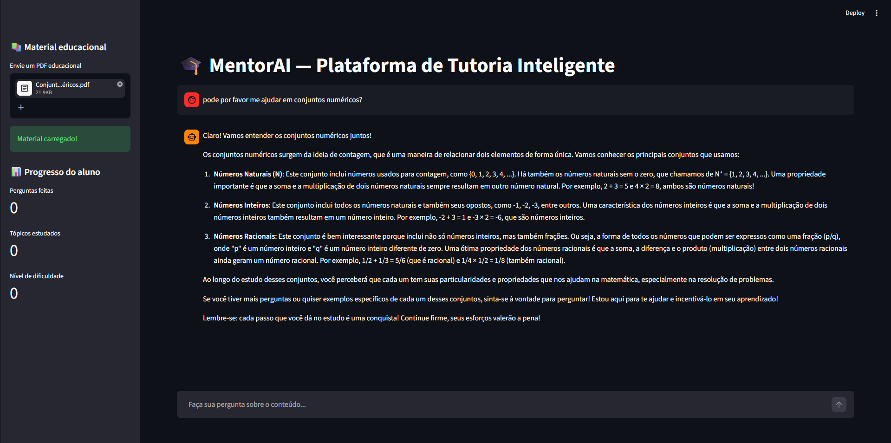

# 🎓 MentorAI — Plataforma de Tutoria Inteligente


> **MentorAI** é uma plataforma educacional impulsionada por Inteligência Artificial que transforma materiais didáticos estáticos (PDFs) em uma experiência interativa. Através de um sistema multi-agentes (CrewAI), a plataforma explica conceitos, avalia o aprendizado e motiva os alunos de forma personalizada.

---

## 📸 Demonstração


---

## ✨ Funcionalidades

- 📄 **Leitura Inteligente:** Upload de PDFs educacionais onde o sistema extrai o contexto para o aprendizado.
- 🤖 **Sistema Multi-Agentes (CrewAI):**
  - 🎓 **Tutor:** Explica conceitos de forma didática ancorado no material enviado.
  - 📝 **Avaliador:** Analisa a qualidade da explicação e monitora os pontos-chave.
  - 💡 **Motivador:** Fornece incentivo contínuo e estratégias práticas de estudo.
- 🔍 **RAG (Retrieval-Augmented Generation):** Zero alucinações. As respostas são estritamente baseadas no conteúdo real do PDF através de busca vetorial.
- 📊 **Dashboard de Progresso:** Acompanhamento em tempo real de perguntas feitas, tópicos estudados e alertas de dificuldade.
- 🛡️ **Guardrails de Segurança:** Filtros rigorosos que bloqueiam linguagem ofensiva, assuntos ilegais, orientação médica e mantêm o foco 100% na educação.

## 🛠️ Tecnologias Utilizadas

- **Interface Web:** [Streamlit](https://streamlit.io/)
- **Orquestração de Agentes:** [CrewAI](https://crewai.com/)
- **LLM Engine:** [OpenAI (GPT-4o-mini)](https://openai.com/)
- **Pipeline RAG & Embeddings:** [LangChain](https://langchain.com/)
- **Vector Store:** [FAISS](https://github.com/facebookresearch/faiss)
- **Processamento de Documentos:** [PyPDF](https://pypdf.readthedocs.io/)

---

## 🚀 Como rodar localmente

### Pré-requisitos
Certifique-se de ter o **Python 3.10+** instalado em sua máquina e uma chave de API válida da [OpenAI](https://platform.openai.com/api-keys).

**1. Clone o repositório**
```bash
git clone [https://github.com/daniellwendyson/studymate-ai.git](https://github.com/daniellwendyson/studymate-ai.git)
cd studymate-ai
```

**2. Crie e ative o ambiente virtual**
```bash
python -m venv venv

# No Windows:
venv\Scripts\activate

# No Linux/Mac:
source venv/bin/activate
```

**3. Instale as dependências**
```bash
pip install -r requirements.txt
```

**4. Configure as variáveis de ambiente**
Crie uma cópia do arquivo de exemplo para as variáveis de ambiente:
```bash
cp .env.example .env
```
Abra o arquivo `.env` gerado e insira a sua chave da OpenAI: `OPENAI_API_KEY=sk-sua-chave-aqui`

**5. Rode a aplicação**
```bash
streamlit run app.py
```

## 📖 Como usar
1. Abra a URL local gerada pelo Streamlit (geralmente http://localhost:8501).

2. No menu lateral (Sidebar), faça o upload de um arquivo PDF educacional.

3. Aguarde o processamento do material.

4. No chat central, faça perguntas sobre o conteúdo do material (Ex: "Me explique o conceito de X que está na página 2").

5. Acompanhe seu progresso e o plano de estudos gerado automaticamente no painel inferior!

## 📁 Estrutura do projeto

```bash
studymate-ai/
├── app.py            # Interface Streamlit e orquestração do RAG + Agentes
├── agents.py         # Configuração dos agentes do CrewAI (Tutor, Avaliador, Motivador)
├── rag.py            # Processamento do PDF, divisão de texto (chunks) e FAISS
├── guardrails.py     # Lógica de segurança e moderação de conteúdo
├── data/             # Diretório temporário gerado automaticamente para os PDFs
├── requirements.txt  # Dependências do Python
└── .env.example      # Template de variáveis de ambiente
```

## 🤝 Contribuindo
Contribuições são muito bem-vindas! Se você tiver alguma ideia para melhorar o projeto, sinta-se à vontade para abrir uma issue ou enviar um pull request.

1. Faça um Fork do projeto

2. Crie sua Feature Branch (`git checkout -b feature/IncrivelFeature`)

3. Faça o Commit de suas mudanças (`git commit -m 'Add some IncrivelFeature'`)

4. Faça o Push para a Branch (`git push origin feature/IncrivelFeature`)

5. Abra um Pull Request

## 👨‍💻 Autor
Daniel Wendyson

GitHub: @daniellwendyson

LinkedIn: https://www.linkedin.com/in/daniellwendyson/

